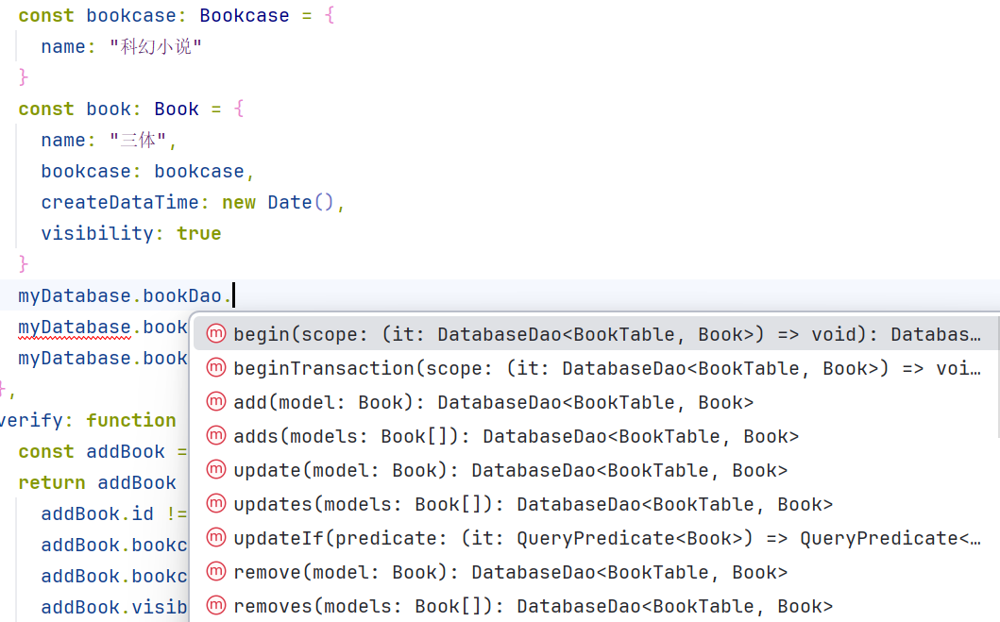

## 介绍

`Storm`是直接基于纯`TypeScript`编写的高效简洁的`OpenHarmonyOS SQL ORM`框架。

## 安装

在命令行中执行以下命令。

```text
ohpm install @zxhhyj/storm
```

## 基本用法

### 创建数据库

创建`AppDatabase.ts`文件，并实现以下代码。

```typescript
import { AutoMigration, Database, DatabaseMigration, MigrationHelper, Storm } from '@zxhhyj/storm';
import { relationalStore } from '@kit.ArkData';
import { Context } from '@kit.AbilityKit';

class AppDatabase extends Database {
  initDb(context: Context) {
    return relationalStore.getRdbStore(context, { name: "app.db", securityLevel: relationalStore.SecurityLevel.S1 })
    //重写`AppDatabase`中的`initDb`函数，在此返回你的`RdbStore`
  }
}

export const myDatabase = Storm
  .databaseBuilder(AppDatabase)
  .setVersion(1)//设置数据库的版本
  .addMigrations(AutoMigration)//设置当数据库未初始化时自动初始化，初始化后的版本号为 setVersion 设置版本号，即 1
  .build()
```

另参[AppDatabase.ts](entry/src/main/ets/logic/database/AppDatabase.ts)。

如果你想自己执行`sql`语句来建表，可以参考[3.升级数据库](#3升级数据库)

### 定义表结构

#### 1.定义书架类

创建`Bookcase.ts`文件，并实现以下代码。

```typescript
import { Column, Table } from '@zxhhyj/storm';

export interface Bookcase {
id?: number
name: string
}

export class BookcaseTable extends Table<Bookcase> {
  readonly tableName = 't_bookcase'

  readonly id = Column.integer('id').primaryKey(true).bindTo(this, 'id')
  readonly name = Column.text('name').notNull().bindTo(this, 'name')
}

export const TableBookcase = new BookcaseTable()
```

另参[Bookcase.ts](entry/src/main/ets/logic/model/Bookcase.ts)。

如果你有使用`sql`的经验，那么不难看出：

1. `Bookcase`是你的实体模型。
2. `BookcaseTable`是你的表，`tableName`是你的表名，`id`和`name`是你表中的列，你可以调用`Column`来描述列。

最后`new BookcaseTable()`，然后导出。大部分情况下，不建议你导出`Table`。

PS:_推荐使用使用`interface`或`declare class`来修饰`model`_

#### 2.定义书本类

创建`Book.ts`文件，并实现以下代码。

```typescript
import { Column, Dao, Storm, Table } from '@zxhhyj/storm';
import { Bookcase, TableBookcase } from './Bookcase';

export interface Book {
id?: number
name: string
bookcase: Bookcase
createDataTime: Date
visibility: boolean
}

export class BookTable extends Table<Book> {
  readonly tableName = 't_book'

  readonly id = Column.integer('id').primaryKey(true).bindTo(this, 'id')

  readonly name = Column.text('name').unique().bindTo(this, 'name')

  readonly bookcase = Column.references('bookcase_id', TableBookcase).bindTo(this, 'bookcase')

  readonly createDataTime =
    Column.date('create_data_time').default(new Date().toString()).bindTo(this, 'createDataTime')

  readonly visibility = Column.boolean('visibility').bindTo(this, 'visibility')

  readonly datetimeIndex =
    Column.index('t_book_index_name').column(this.name, 'ASC').column(this.visibility).bindTo(this)
}

export const TableBook = new BookTable()
``` 

另参[Book.ts](entry/src/main/ets/logic/model/Book.ts)。

### 初始化数据库

现在需要把导出的`Table`实例在`AppDatabase.ts`中声明，这样`Storm`
就能识别并为这两张表创建`Dao`了。

另外你可以利用这个特性，将不同的表与数据库分隔开。

```typescript
import { AutoMigration, Database, Storm } from '@zxhhyj/storm';
import { relationalStore } from '@kit.ArkData';
import { TableBookcase } from '../model/Bookcase';
import { DaoMyBook, TableBook } from '../model/Book';
import { TableBlob } from '../model/Blob';
import { Context } from '@kit.AbilityKit';

class AppDatabase extends Database {
  initDb(context: Context) {
    return relationalStore.getRdbStore(context, { name: "app.db", securityLevel: relationalStore.SecurityLevel.S1 })
    //重写`AppDatabase`中的`initDb`函数，在此返回你的`RdbStore`
  }

  readonly bookDao = TableBook
  readonly bookcaseDao = TableBookcase
  //将前文中定义的两个表写到 AppDatabase 下，建议以 Dao 结尾
}
```

现在你会发现，`AppDatabase`中的`TableBook`、`TableBookcase`都变成了`Dao`，你现在可以调用它们来进行增删改查等操作了。



最后在使用前，必须调用`myDatabase.init(context)`函数进行初始化，你可以在`AbilityStage`中初始化。

```typescript
import { AbilityStage, Want } from '@kit.AbilityKit';
import { myDatabase } from './logic/database/AppDatabase';

export default class AppAbilityStage extends AbilityStage {
  async onCreate() {
    await myDatabase.init(this.context)
  }

  onAcceptWant(_want: Want): string {
    return 'AppAbilityStage';
  }
}
```

### 增删改查

#### 1.增加数据

```typescript
import { database } from '@zxhhyj/storm'

const bookcase: Bookcase = {
  name: "科幻小说"
}
const book: Book = {
  name: "三体",
  bookcase: bookcase,
  createDataTime: new Date(),
  visibility: true
}
myDatabase.bookcaseDao.add(bookcase)
myDatabase.bookDao.add(book)
```

#### 2.删除数据

```typescript
const bookcase: Bookcase = {
  name: "科幻小说"
}
myDatabase.bookcaseDao
  .add(bookcase)
  .begin(() => {
    bookcase.name = "女生小说"
    //修改 name 的值
  })
  .update(bookcase) //将修改后的值更新到数据库中
```

使用`update`需要数据中存在主键，否则将触发异常。
如果需要使用`RdbPredicates`，可以使用`updateIf`。

```typescript
const bookcase: Bookcase = {
  name: "科幻小说"
}
myDatabase.bookcaseDao
  .add(bookcase)
  .updateIf(it => it.equalTo(TableBookcase.id, bookcase.id), { name: '女生小说' })
```

#### 3.删除数据

```typescript
myDatabase.bookcaseDao
  .add(bookcase)
  .remove(bookcase) //移除数据
```

使用`remove`需要数据中存在唯一主键，否则将触发异常。
如果不知道主键或需要使用`RdbPredicates`，可以使用`removeIf`。

```typescript
import { database } from '@zxhhyj/storm'

const bookcase: Bookcase = {
  name: "科幻小说"
}
database
  .of(bookcases)
  .add(bookcase)
  .removeIf(it => it.equalTo(bookcases.name, "科幻小说")) //指定条件来删除数据
```

#### 4.查询数据

```typescript
const list = myDatabase.bookDao.toList()
//查询 BookTable 在数据库中全部的数据
```

```typescript
const list = myDatabase.bookDao.toList(it => it.equalTo(TableBook.name, '三体'))
//查询 BookTable 在数据库中符合条件的全部数据
```

```typescript
const list = myDatabase.bookDao.toList(it => it.equalTo(TableBook.name, '三体'), TableBook.name)
for (const listElement of list) {
  console.log(listElement.name.toString())
  listElement.id //ide 会报错，找不到这个属性
}
//查询 BookTable 在数据库中符合条件的全部数据，同时指定只查询 name 列
```

更多查询方式另参[DatabaseDao](library/src/main/ets/database/DatabaseDao.ts)。

#### 5.使用事务

```typescript
try {
  const bookcase: Bookcase = {
    name: "科幻小说"
  }
  myDatabase.bookcaseDao.beginTransaction(database => {
    database.add(bookcase)
    throw new Error('强制停止，让事务回滚')
  })
} catch (e) {
  //...
}
```

#### 6.使用 Promise

```typescript
myDatabase.beginAsync((database) => {
  //...
})
```

### 高阶用法

构建健壮的代码所必须的功能。

#### 1.自定义 Dao

在`Book.ts`文件下补充以下代码。

```typescript
class MyBookDao extends Dao<BookTable> {
  add(book: Book) {
    this.dao.add(book)
    //...
  }

  remove(book: Book) {
    this.dao.remove(book)
    //...
  }

  //...
}

export const DaoMyBook = Storm.daoBuilder(MyBookDao).select(TableBook).build()
```

然后将导出的实例在`AppDatabase`中声明。

```typescript
//...

class AppDatabase extends Database {
  initDb(context: Context) {
    return relationalStore.getRdbStore(context, { name: "app.db", securityLevel: relationalStore.SecurityLevel.S1 })
    //重写`AppDatabase`中的`initDb`函数，在此返回你的`RdbStore`
  }

  readonly bookDao = TableBook
  readonly bookcaseDao = TableBookcase

  readonly myBookDao = DaoMyBook
  //在此声明
}

//...
```

现在你可以访问你的自定义`Dao`了。

#### 2.多数据源

参考[创建数据库](#创建数据库)，创建不同的`Database`即可。

#### 3.升级数据库

我们这里假设你的数据库要从版本`1`升级至`2`，要在`Bookcase`中新增一个字段`alias`。以前文的`Bookcase.ts`为例。

```typescript
//...

export interface Bookcase {
id?: number
name: string
alias?: string
//在实体中声明这个属性
}

class BookcaseTable extends Table<Bookcase> {
  readonly tableName = 't_bookcase'

  readonly id = Column.integer('id').primaryKey(true).bindTo(this, 'id')
  readonly name = Column.text('name').notNull().bindTo(this, 'name')
  readonly alias = Column.text('alias').default(null).bindTo(this, 'alias')
  //在实体中声明这个属性
}

//export const TableBookcase = new BookcaseTable()

const Migration_1_2 = new class extends TableMigration<BookcaseTable> {
  readonly startVersion: number = 1
  readonly endVersion: number = 2

  migrate(targetTable: BookcaseTable, helper: MigrationHelper): void {
    helper.executeSync(SupportSqliteCmds.select(targetTable).addColumn(targetTable.alias))
    //执行命令升级数据库
  }
}

export const TableBookcase = Storm
  .tableBuilder(BookcaseTable)
  .addMigrations(Migration_1_2)//将升级的逻辑添加到表的构建器中
  .build()

//...
```

转到`AppDatabase`中。将数据库最新版本设置为`2`，然后添加`DatabaseMigration.create(1, 2)`。

```typescript
//...

export const myDatabase = Storm
  .databaseBuilder(AppDatabase)
  .setVersion(2)//将数据库的最新版本设置为2
  .addMigrations(AutoMigration, DatabaseMigration.create(1, 2))
  .build()
```

这里将数据库最新版本设置为`2`，然后添加了新的迁移逻辑`DatabaseMigration.create(1, 2)`，它的意思是：

当数据库初始化时检查到当前的版本为`1`时，将触发数据库版本升级至`2`
。然后触发在`Bookcase`中添加的迁移逻辑`Migration_1_2`，至此完成了数据库的版本升级。

#### 4.手动初始化数据库

待补充。

### 开源协议

本项目基于 [Apache License 2.0](LICENSE)。

### 交流

如有疑问，请提`issues`或者致信到我的邮箱`957447668@qq.com`。